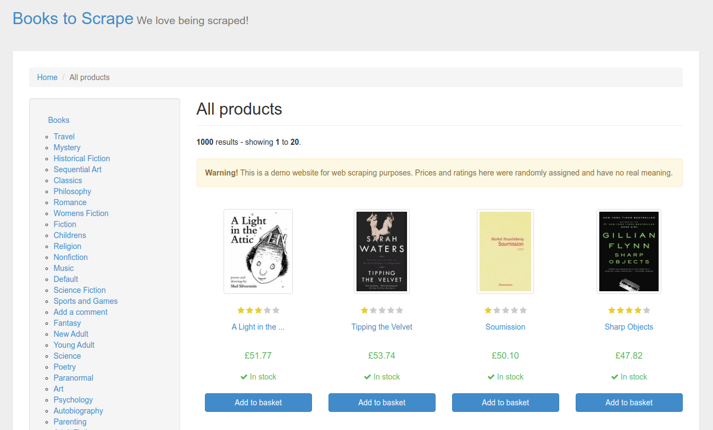
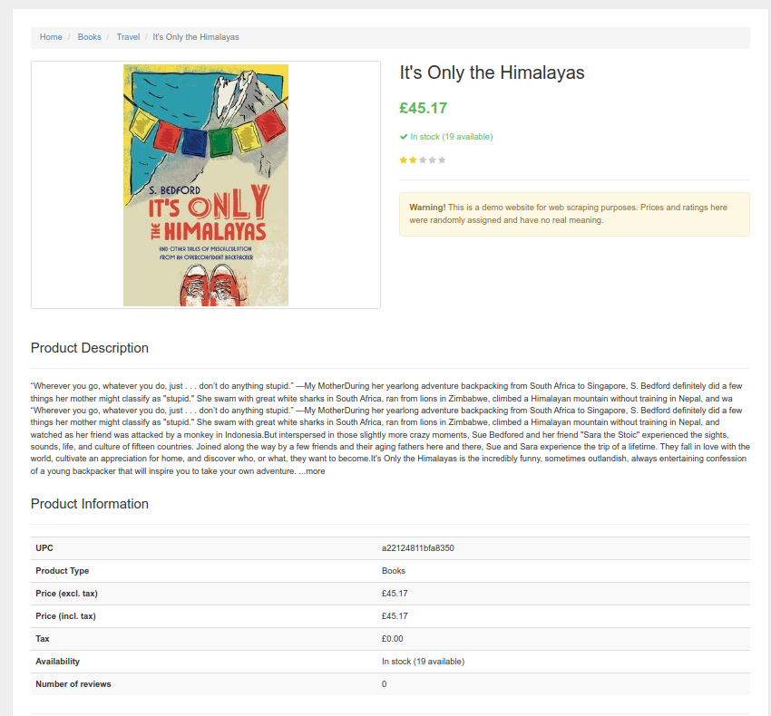
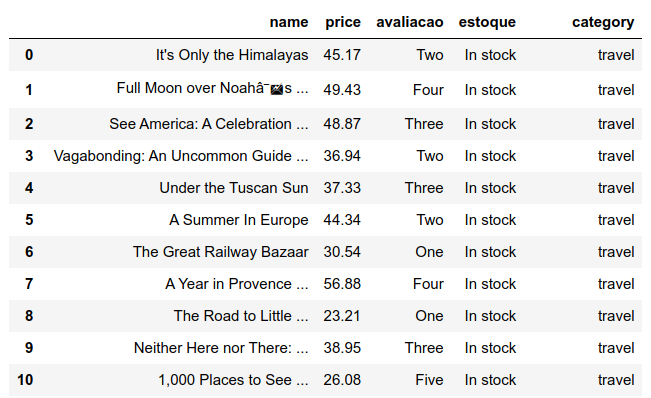
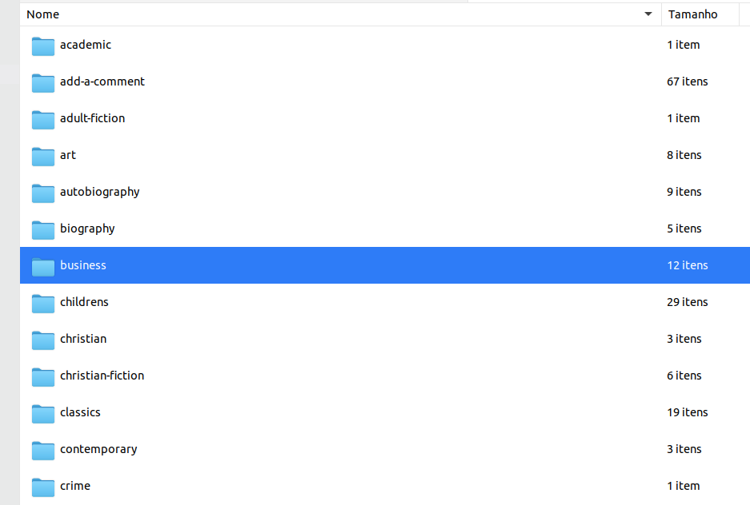

# Projeto de Estudo Books to Scrape

Este projeto de estudo que compõe o meu portfólio profissional busca coletar dados existentes na página "Books to Scrape". Convém mencionar que a página tem como objetivo simular um e-commerce de livros para que pessoas possam treinar as sua habilidades nas técnicas de WebScraping.

O projeto está estruturado nos seguintes passos:

1. Questão de negócio
2. Premissas do projeto
3. Planejamento da solução
4. Análise e resultados obtidos
5. Conclusão do projeto
6. Próximos passos

## 1 Questão de negócio

A página "Books to Scrape" simula um e-commerce de livros e apresenta 1000 produtos catalogados em 50 categorias distintas. O site apresentar "todos os produtos" simultaneamente, sendo 50 páginas com 20 livros em cada. Além disso, há a opção de apresentação apenas dos títulos de cada categoria. Observa-se que para cada livro há várias informações disponíveis tais como, título completo, imagem da capa, descrição do produto através da sinopse, número de estrelas da avaliação, preços em Euros com e sem as taxas, valor da taxa, disponibilidade de livros em estoque, tipo de produto e código UPC.

Dentro do contexto da ciência de dados a página oferece uma excelente opção para treinamento das técnicas de webscraping voltados para sites da modalidade e-commerce. O projeto de estudo busca coletar dados de todos os livros que se encontram localizados no endereço: "https://books.toscrape.com/" .

As principais informações a serem extraídas do site:

* Nome do livro
* Preço em libras
* Avaliação dos consumidores
* Disponibilidade em estoque
* Categoria
* Imagem da capa

Convém mencionar que na data da elaboração desse trabalho há 1000 livros distribuidos em várias páginas e categorias. Diante desse cenário, o objetivo específico a ser alcançado com base na solução do problema consiste em desenvolver uma ferramenta capaz de coletar todos esses dados de forma automatizada.

## 2 Premissas do projeto

Este é um projeto de estudo e não possui nenhuma finalidade comercial, sendo desenvolvido com base nos conhecimentos do autor sobre as técnicas de web scraping existentes no ecossistema Python.

## 3 Planejamento da solução

### 3.1 Produto proposto

Desenvolver um script Python capaz de navegar nas páginas do site e coletar todos os dados. Após a coleta automatizada será gerado um arquivo "df_todos_livros.csv" com todas as informações extraídas. Além disso, as imagens das capas dos livros serão organizadas em pastas por categoria. Ressalta-se que também será disponibilizado um notebook mostrando todo o processo de web scraping.

### 3.2 Ferramentas utilizadas

* Python
* Pandas
* Beautiful Soup
* Jupyter Notebook
* Requests

<table>
  <tbody>
    <tr valign="top">
      <td width="25%" align="center">
        Python  
        
      </td>
      <td width="25%" align="center">
        pandas  
        
      </td>
      <td width="25%" align="center">
        Beautiful Soap  
        
      </td>
      <td width="25%" align="center">
        Jupyter  
        
      </td>
    </tr>
    <tr valign="top">
      <td width="25%" align="center">
        Requests  
        
      </td>
    </tr>
  </tbody>
</table>

### 3.3 Processo

Ao todo a execução da solução do projeto será dividida em 4 passos:

1. Criando o projeto Books to Scrape
2. Web Scraping de todos os livros
3. Verificação das informações coletadas
4. df_todos_livros.csv

## 4 Análise e resultados obtidos

Foram coletadas todas as informações dos 1000 livros conforme o escopo do projeto.

As imagens dos livros foram organizadas em pastas por categoria.

## 5. Conclusão do projeto

O presente projeto de estudo cumpriu o seus objetivos e após todo o desenvolvimento foi possível construir o script Python capaz de coletar de forma automatizada todas as informações existentes site "Books to Scrape". Além disso, o notebook com todo processo de construção da solução também encontra-se disponível no presente repositório. Vale mencionar que as técnicas de web scraping são fundamentais no contexto de resolução de problemas de negócio envolvendo ciência de dados.

## 6. Próximos passos

Ressalta-se que após a finalização desse projeto de estudo é possível fazer uma análise exploratória dos dados tendo em vista as avaliações e preços dos livros por categoria.

### Autor

Deivison Morais. Visite o meu portfólio de projetos [aqui.](https://deivison1983.github.io/portfolio_projetos/)

### Contatos

  
  

