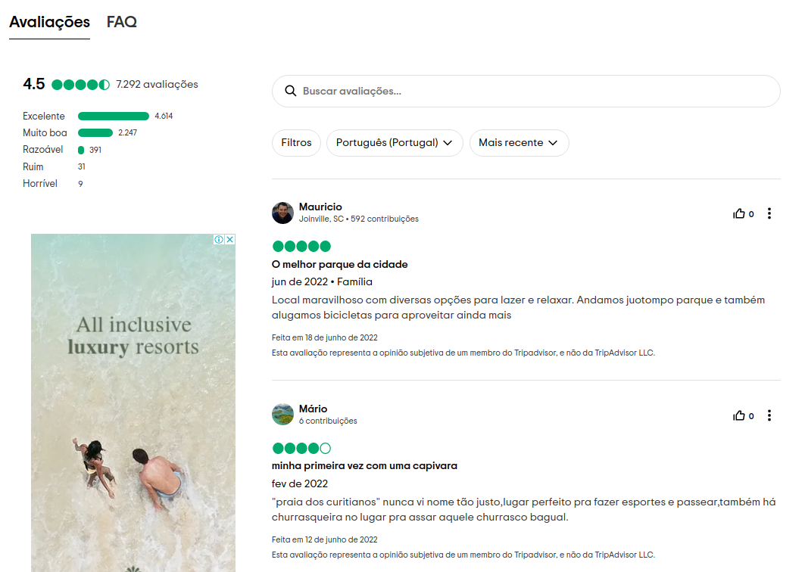
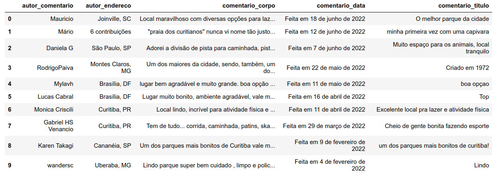

# Projeto de estudo Tripadvisor

Este projeto de estudo que compõe o meu portfólio profissional busca coletar os comentários de usuários sobre o Parque Barigui existentes dentro da plataforma de viagens Tripadvisor. Convém mencionar que o parque é um dos mais importantes pontos turísticos da cidade de Curitiba-PR e apresenta milhares de comentários de pessoas de todo o Brasil.

O projeto está estruturado nos seguintes passos:

1. Questão de negócio
2. Premissas do projeto
3. Planejamento da solução
4. Análise e resultados obtidos
5. Conclusão do projeto
6. Próximos passos

## 1 Questão de negócio

O Tripadvisor é uma das maiores plataformas de viagens do mundo e auxilia milhões de pessoas que desejam viajar, conhecer pontos turisticos e planejar os seus momentos de lazer. Segundo a plataforma há mais de 859 milhões de avaliações e aproximadamente 9 milhões de acomodações, restaurantes, experiências, companhias aéreas e cruzeiros. O Tripadvisor está disponível em 49 mercados e 28 idiomas sendo utilizado para comparar preços de hotéis, voos e cruzeiros, para reservar excursões e atrações badaladas, bem como para fazer reservas em ótimos restaurantes.

Dentro do contexto da ciência de dados a plataforma pode ser utilizada como uma importante fonte de dados para resolução de problemas de negócios dos setores de serviço, turismo e comércio. O projeto de estudo busca coletar dados sobre os comentários do Parque Barigui que se encontram localizados no endereço: https://www.tripadvisor.com.br/Attraction_Review-g303441-d553398-Reviews-Parque_Barigui-Curitiba_State_of_Parana.html .

As principais informações a serem extraídas na seção de comentários da plataforma correspondem a:

* Nome do autor do comentário
* Localização do autor do comentário
* Comentário do autor
* Título do comentários
* Data do comentário

Convém mencionar que na data da elaboração desse trabalho há mais de 7 mil comentários relacionados ao parque que se encontram distribuídos ao longo de mais de 700 páginas. O primeiro cometário sobre o Parque Barigui foi registrado em 12 de março de 2006. Diante desse cenário, o objetivo específico a ser alcançado com base na solução do problema consiste em desenvolver uma ferramenta capaz de coletar todos esses dados de forma automatizada.

## 2 Premissas do projeto

Este é um projeto de estudo e não possui nenhuma finalidade comercial, sendo desenvolvido com base nos conhecimentos do autor sobre as técnicas de web scraping existentes no ecossistema Python.

## 3 Planejamento da solução

### 3.1 Produto proposto

Construir um Web Crawler Python capaz de navegar nas páginas dos comentários e coletar os dados na plataforma do Tripadvisor. Após a coleta automatizada será gerado um arquivo "informacoes.csv" com todas as informações extraídas. Além disso, foi elaborado um notebook mostrando todo o processo de construção do web crawler.

### 3.2 Ferramentas utilizadas

* Python
* Pandas
* Scrapy
* Jupyter Notebook

<table>
  <tbody>
    <tr valign="top">
      <td width="25%" align="center">
        Python  
        
      </td>
      <td width="25%" align="center">
        pandas  
        
      </td>
      <td width="25%" align="center">
        Scrapy  
        
      </td>
      <td width="25%" align="center">
        Jupyter  
        
      </td>
    </tr>
  </tbody>
</table>

### 3.3 Processo

Ao todo a execução da solução do projeto será dividida em 7 passos:

1. Criando o projeto TripAdvisor
2. Identificar os padrões dos comentários
3. Teste na API da plataforma com o Scrapy shell
4. Alterar as configurações do arquivo items.py na pasta do projeto
5. Código da aranha (spider)
6. Executar o Web Crawler
7. Arquivo informacoes.csv

## 4 Análise e resultados obtidos

Foram coletados 7065 comentários sendo o primeiro comentário realizado em 12 de março de 2006 e o último em 18 de junho de 2022.

Outras observações registradas:

* Vinte e nove linhas estão sem comentário e sem título do comentário
* Duas linhas se encontram sem autor do comentário.
* Foram registradas 6516 usuários distintos.
* O número de localidades registradas corresponde a 1060, porém alguns desses registros foram preenchidos com o número de contribuições do usuário devido a ausência dessas informações nos respectivos perfis.

## 5. Conclusão do projeto

O presente projeto de estudo cumpriu o seus objetivos e após todo o desenvolvimento foi possível construir o Web Crawler Python capaz de coletar de forma automatizada todas as informações existentes na seção de comentário do Parque Barigui da plataforma Tripadvisor. Além disso, o notebook com todo processo de construção da solução também encontra-se disponível no presente repositório. Vale mencionar que as técnicas de web scraping são fundamentais no contexto de resolução de problemas de negócio envolvendo ciência de dados.

## 6. Próximos passos

Ressalta-se que após a finalização desse projeto de estudo é possível seguir por vários caminhos distintos. Essa decisão se dá em função dos vários tipos de análises que podem ser realizadas com os dados coletados, entre as quais destacamos:

* Realizar uma análise exploratória de dados (EDA).
* Analisar o perfil demográfico dos visitantes/frequentadores do Parque.
* Construir um dashboard com o perfil dos usuários que comentaram sobre o Parque Barigui.
* Analisar as palavras e adjetivos mais frequentes nos cometários.
* Analisar quais épocas do ano o parque recebe mais comentários/visitantes.
* Analisar a evolução da quantidade de frequentadores com o decorrer do tempo.
* Construir análises de tendências.

### Autor

Deivison Morais. Visite o meu portfólio de projetos [aqui.](https://deivison1983.github.io/portfolio_projetos/)

### Contatos

  
  

